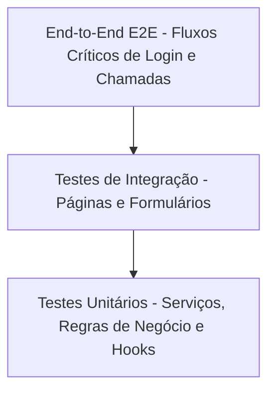

# 🧪 Guia de Quality Assurance (QA) — Hemera OS

Este documento serve como diretriz oficial para a garantia de qualidade e automação de testes do **Hemera OS** (Frontend/React).

---

## 1. Estratégia de Testes

Para garantir a estabilidade do ecossistema e evitar regressões à medida que novos submódulos são acoplados, adotamos uma estratégia de testes em pirâmide:



1. **Testes Unitários (Vitest):** Focados em isolar regras de negócio puras (ex: cálculo de XP, conversões de dados, helpers) e chamadas de API mockadas em `src/services/`.
2. **Testes de Componentes/Integração (React Testing Library + JSDOM):** Garantem que os componentes renderizem corretamente, reajam a eventos de cliques, formulários e exibam estados de erro/sucesso.
3. **Testes E2E (Futuro / Playwright):** Recomendados para testar fluxos multilocatários críticos (ex: jornada completa de login com bypass de autenticação e lançamento de nota/chamada).

---

## 2. Ferramental & Configuração

O ambiente de testes do frontend é composto por:
- **Vitest**: Executor de testes veloz compatível com o ecossistema Vite.
- **JSDOM**: Simula um ambiente de navegador em Node.js para que o React Testing Library possa montar componentes.
- **React Testing Library (@testing-library/react)**: Utilitários para testar componentes focando no comportamento do usuário final (em vez de detalhes internos de implementação).
- **@testing-library/jest-dom**: Adiciona matchers personalizados como `.toBeInTheDocument()`, `.toHaveValue()`, etc.

---

## 3. Padrões & Boas Práticas

### Convenção de Arquivos
- Todos os arquivos de teste devem seguir o sufixo: `.test.ts` (para arquivos TS puros/serviços) ou `.test.tsx` (para componentes React).
- Os arquivos devem ser alocados dentro de uma pasta `__tests__` próxima ao código testado ou na pasta global `src/test/`.

### Isolamento de Testes e Limpeza de Estado
Sempre utilize `beforeEach` e `afterEach` para resetar mocks e estados de variáveis globais locais (como `mockXP` do serviço de gamificação):
```typescript
import { beforeEach, describe, it, expect, vi } from "vitest";

beforeEach(() => {
  vi.clearAllMocks();
  vi.resetModules(); // Reseta módulos se houver estado interno de arquivo (ex: let mockXP)
});
```

### Como Mockar o Supabase Cliente
Para evitar chamadas de rede reais durante a execução dos testes unitários, o cliente do Supabase deve ser mockado usando `vi.mock('@/integrations/supabase/client')`.

Exemplo padrão de mock:
```typescript
import { vi } from "vitest";

vi.mock('@/integrations/supabase/client', () => ({
  supabase: {
    auth: {
      getUser: vi.fn(),
    },
    from: vi.fn(() => ({
      select: vi.fn().mockReturnThis(),
      eq: vi.fn().mockReturnThis(),
      single: vi.fn(),
      maybeSingle: vi.fn(),
      upsert: vi.fn(),
    })),
  },
}));
```

---

## 4. Como Executar os Testes

### Execução em Lote (CI/CD ou Pré-commit)
Para rodar todos os testes de forma rápida e gerar relatórios:
```bash
npm run test
```

### Modo Interativo (Desenvolvimento Local)
Para manter o Vitest monitorando alterações nos arquivos em tempo real (Watch Mode):
```bash
npm run test:watch
```
